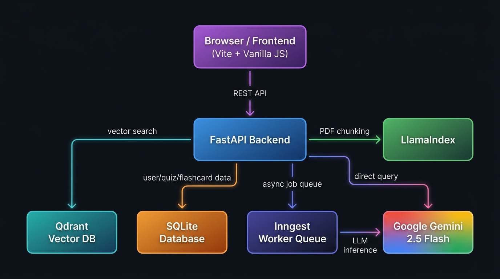

<div align="center">

# 🧠 RAG Production App

### *A production-grade Retrieval-Augmented Generation platform — upload your PDFs and instantly chat, quiz, and flashcard your way through any knowledge base.*

<br/>

[](https://fastapi.tiangolo.com/)
[](https://python.org)
[](https://qdrant.tech/)
[](https://ai.google.dev/)
[](https://docker.com/)
[](https://vitejs.dev/)
[](https://inngest.com/)

<br/>

> **Chat with your documents. Generate quizzes. Build flashcard decks. All powered by Google Gemini 2.5 Flash and a production-ready RAG pipeline.**

</div>

---

## ✨ Features

| Feature | Description |
|---|---|
| 📄 **PDF Ingestion** | Upload PDFs and have them automatically chunked, embedded, and stored in a vector database |
| 💬 **AI Chat (RAG)** | Ask questions against your knowledge base — answers grounded in your documents with cited sources |
| 🧩 **Quiz Generation** | Instantly generate multiple-choice quizzes from any knowledge base, with explanations |
| 🃏 **Flashcard Decks** | Auto-generate study flashcard sets with interactive flip animations |
| 📚 **Knowledge Bases** | Organise documents into named knowledge bases — isolated vector collections per user |
| 🔐 **Authentication** | JWT-based auth with secure bcrypt password hashing |
| ⚡ **Async Processing** | PDF ingestion is handled by Inngest — throttled, rate-limited, and durable background jobs |
| 🐳 **Docker Compose** | One command to spin up the entire stack: backend, Qdrant, and Inngest |

---

## 🏗️ Architecture



The application follows a clean layered architecture:

1. **Frontend** (Vite + Vanilla JS) sends REST requests to the FastAPI backend
2. **FastAPI** orchestrates all business logic — auth, KB management, querying, and AI generation
3. **PDF Uploads** are processed via **Inngest** background jobs (throttled to 2/min, rate-limited to 1 per document per 4 hours)
4. **LlamaIndex** reads and chunks PDFs; **Google Gemini Embedding** (`gemini-embedding-2`, 3072-dim) creates vector representations
5. **Qdrant** stores and searches those vectors via cosine similarity
6. At query time, the top-k chunks are retrieved and sent to **Gemini 2.5 Flash** for answer synthesis
7. **SQLite** (via SQLAlchemy) persists users, knowledge bases, quizzes, and flashcard sets

---

## 🛠️ Tech Stack

### Backend

| Technology | Version | Role |
|---|---|---|
| [**FastAPI**](https://fastapi.tiangolo.com/) | `≥0.141` | REST API framework — async, typed, OpenAPI auto-docs |
| [**Uvicorn**](https://www.uvicorn.org/) | `≥0.52` | ASGI server running the FastAPI app |
| [**SQLAlchemy**](https://www.sqlalchemy.org/) | `≥2.0` | ORM for SQLite — users, knowledge bases, quizzes, flashcards |
| [**Pydantic**](https://docs.pydantic.dev/) | (via FastAPI) | Request/response validation and serialisation |
| [**PyJWT**](https://pyjwt.readthedocs.io/) | `≥2.13` | JWT token creation and verification for auth |
| [**Passlib + bcrypt**](https://passlib.readthedocs.io/) | `≥1.7 / ≥5.0` | Secure password hashing |
| [**python-dotenv**](https://pypi.org/project/python-dotenv/) | `≥1.2` | Environment variable management |
| [**python-multipart**](https://pypi.org/project/python-multipart/) | `≥0.0.9` | File upload support (PDF ingestion) |

### AI & Vector Search

| Technology | Version | Role |
|---|---|---|
| [**Google Gemini (`google-genai`)**](https://ai.google.dev/) | `≥2.19` | LLM for answer synthesis, quiz/flashcard generation (`gemini-2.5-flash`); embeddings (`gemini-embedding-2`, 3072-dim) |
| [**LlamaIndex Core**](https://www.llamaindex.ai/) | `≥0.14` | PDF document loading and sentence-based text chunking |
| [**LlamaIndex PDF Reader**](https://pypi.org/project/llama-index-readers-file/) | `≥0.6` | Extracts raw text from PDF files |
| [**Qdrant Client**](https://qdrant.tech/) | `≥1.19` | Python client for the Qdrant vector database |

### Background Jobs

| Technology | Version | Role |
|---|---|---|
| [**Inngest**](https://www.inngest.com/) | `≥0.5.19` | Durable background workflow engine — PDF ingestion pipeline with throttling, rate limiting, and retries. Also provides AI inference via `ctx.step.ai.infer` |

### Frontend

| Technology | Version | Role |
|---|---|---|
| [**Vite**](https://vitejs.dev/) | `^8.2` | Lightning-fast build tool and dev server |
| **Vanilla JavaScript** | ES Modules | SPA logic — routing, API calls, DOM rendering |
| **Vanilla CSS** | — | Custom design system — dark mode, glassmorphism, animations |
| [**marked.js**](https://marked.js.org/) | `^18` | Renders Markdown responses from Gemini in the chat UI |

### Infrastructure & DevOps

| Technology | Role |
|---|---|
| [**Docker + Docker Compose**](https://docker.com/) | Multi-stage image build (Node → Python); orchestrates app + Qdrant + Inngest |
| **SQLite** | Zero-config relational database persisted on the host via a Docker volume |
| **Qdrant** (Docker) | Self-hosted vector database — data persisted via `./qdrant_storage` bind-mount |
| **Inngest** (Docker) | Self-hosted workflow runner connecting back to the FastAPI app |
| [**uv**](https://docs.astral.sh/uv/) | Ultra-fast Python package manager and environment manager (`uv sync --frozen`) |

---

## 🚀 Getting Started

### Prerequisites

- [Docker Desktop](https://www.docker.com/products/docker-desktop/) installed and running
- A [Google Gemini API Key](https://aistudio.google.com/app/apikey)

### 1. Clone the Repository

```bash
git clone https://github.com/your-username/RAGProductionApp.git
cd RAGProductionApp
```

### 2. Set Up Environment Variables

Create a `.env` file in the project root:

```env
GEMINI_API_KEY=your_google_gemini_api_key_here
SECRET_KEY=your_super_secret_jwt_key_here
```

### 3. Launch with Docker Compose

```bash
docker compose up --build
```

This single command starts:
- 🚀 **FastAPI app** on `http://localhost:8000` (with the built frontend served at `/`)
- 🗄️ **Qdrant** vector database on `http://localhost:6333`
- ⚙️ **Inngest** dev server on `http://localhost:8288`

> **Note:** The first build downloads Docker images and installs all dependencies — subsequent starts are instant.

### 4. Open the App

Navigate to **http://localhost:8000** in your browser.

Register an account, create a Knowledge Base, upload PDFs, and start chatting!

---

## 📁 Project Structure

```
RAGProductionApp/
│
├── main.py              # FastAPI app — all routes, Inngest functions, AI logic
├── database.py          # SQLAlchemy models: User, KnowledgeBase, Quiz, FlashcardSet
├── auth.py              # JWT auth helpers: hash, verify, create_token, get_current_user
├── data_loader.py       # PDF chunking (LlamaIndex) and Gemini embedding
├── vector_db.py         # QdrantStorage wrapper: upsert and cosine similarity search
├── custom_types.py      # Pydantic types for Inngest step I/O
│
├── frontend/
│   ├── index.html       # Single-page app HTML shell
│   ├── main.js          # All SPA logic — routing, API calls, UI rendering
│   ├── style.css        # Full custom design system
│   └── package.json     # Vite + marked.js
│
├── Dockerfile           # Multi-stage build: Node (frontend) → Python (backend)
├── docker-compose.yml   # Orchestrates app + qdrant + inngest
├── pyproject.toml       # Python dependencies (managed by uv)
└── .env                 # API keys and secrets (not committed)
```

---

## 🔄 RAG Pipeline Deep Dive

```
PDF Upload
    │
    ▼
[FastAPI] saves file to /uploads/<user>/<kb>/
    │
    ▼ sends event "rag/ingest_pdf"
[Inngest] picks up the job (throttled: 2/min, rate-limited: 1/doc/4h)
    │
    ├─ Step 1: load-and-chunk
    │   └─ LlamaIndex PDFReader → SentenceSplitter (1000 tokens, 200 overlap)
    │
    └─ Step 2: embed-and-upsert
        └─ Gemini embedding-2 (3072-dim) → Qdrant collection "kb_<id>"

Query Time
    │
    ▼
[FastAPI /api/query]
    ├─ Embed the question via Gemini embedding-2
    ├─ Qdrant cosine similarity search (top-k=5 by default)
    ├─ Assemble context block from retrieved chunks
    └─ Gemini 2.5 Flash generates a grounded, Markdown-formatted answer
```

---

## 🔐 Authentication Flow

All protected routes require a **Bearer JWT token** in the `Authorization` header.

```
POST /api/register  →  Create user (bcrypt hashed password)
POST /api/login     →  Returns JWT access token
                        (OAuth2PasswordRequestForm)
```

The token encodes `{"sub": username}` and is verified on every request via the `get_current_user` FastAPI dependency.

---

## 📡 API Reference

| Method | Endpoint | Description |
|---|---|---|
| `POST` | `/api/register` | Register a new user |
| `POST` | `/api/login` | Login and receive JWT |
| `GET` | `/api/kb` | List all knowledge bases |
| `POST` | `/api/kb` | Create a knowledge base |
| `POST` | `/api/upload` | Upload a PDF to a KB (triggers ingestion) |
| `GET` | `/api/kb/{kb_id}/files` | List uploaded files in a KB |
| `POST` | `/api/query` | RAG query — returns AI answer + sources |
| `POST` | `/api/kb/{kb_id}/quiz/generate` | Generate a multiple-choice quiz |
| `GET` | `/api/kb/{kb_id}/quizzes` | List all quizzes for a KB |
| `GET` | `/api/quiz/{quiz_id}` | Get a quiz with all questions |
| `DELETE` | `/api/quiz/{quiz_id}` | Delete a quiz |
| `POST` | `/api/kb/{kb_id}/flashcards/generate` | Generate a flashcard set |
| `GET` | `/api/kb/{kb_id}/flashcards` | List all flashcard sets for a KB |
| `GET` | `/api/flashcards/{fc_id}` | Get a flashcard set with all cards |
| `DELETE` | `/api/flashcards/{fc_id}` | Delete a flashcard set |

> **Auto-generated interactive docs:** `http://localhost:8000/docs` (Swagger UI)

---

## 🧪 Development (Without Docker)

### Backend

```bash
# Install uv (if not already)
pip install uv

# Create venv and install dependencies
uv sync

# Run the FastAPI dev server
uv run uvicorn main:app --reload --port 8000
```

> Start Qdrant and Inngest separately:
> ```bash
> docker run -p 6333:6333 qdrant/qdrant
> docker run -p 8288:8288 inngest/inngest inngest dev -u http://localhost:8000/api/inngest
> ```

### Frontend

```bash
cd frontend
npm install
npm run dev   # Runs on http://localhost:5173
```

---

## 🤝 Contributing

Contributions, issues, and feature requests are welcome!

1. Fork the repository
2. Create a feature branch (`git checkout -b feature/amazing-feature`)
3. Commit your changes (`git commit -m 'Add amazing feature'`)
4. Push to the branch (`git push origin feature/amazing-feature`)
5. Open a Pull Request

---

## 📄 License

This project is open source. See [LICENSE](LICENSE) for details.

---

<div align="center">

Built with ❤️ by [Hikarunathilake](mailto:hikarunathilake@students.nsbm.ac.lk)

*Powered by Google Gemini · Qdrant · FastAPI · Inngest · LlamaIndex*

</div>
